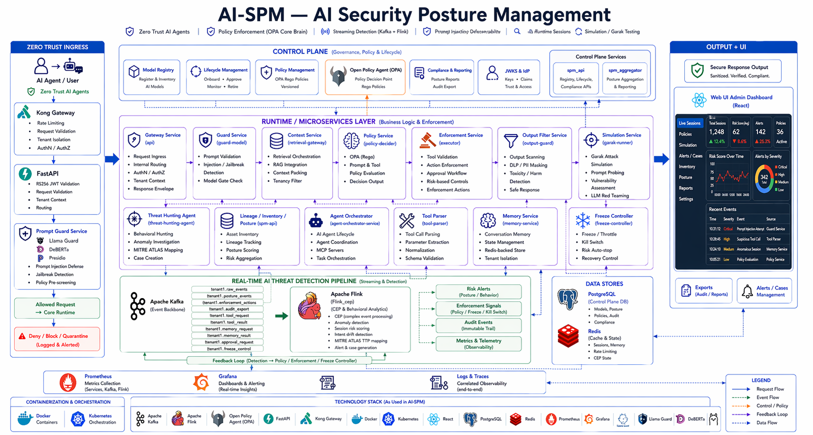
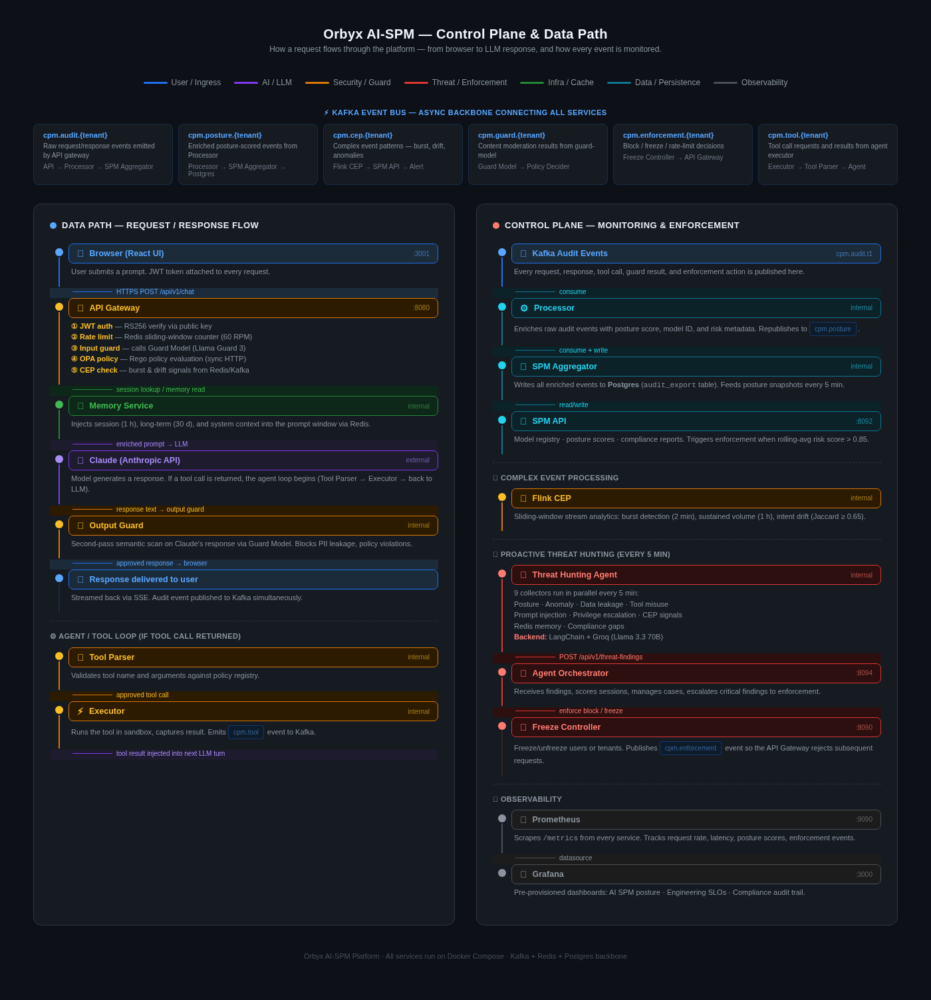

# Orbyx AI SPM  - AI Security Posture Management 

 > AI security posture management (AI-SPM) is a comprehensive approach to maintaining the security and integrity of artificial intelligence (AI) and machine learning (ML) systems. It involves continuous monitoring, assessment, and improvement of the security posture of AI models, data, and infrastructure. AI-SPM includes identifying and addressing vulnerabilities, misconfigurations, and potential risks associated with AI adoption, as well as ensuring compliance with relevant privacy and security regulations.

This opensource project dedicated to implementing Enterprise level AI-SPM. By doing so organizations can proactively protect their AI systems from threats, minimize data exposure, and maintain the trustworthiness of their AI applications (agents, mpc servers, models and more).
Your organization is putting everything it’s got into AI applications—are you prepared to secure them? <br>
Before you answer, think about these specific questions:<br>
Can you identify all the shadow AI (including AI models, agents and associated resources) that's in your environment?<br>
Are you effectively securing AI data to prevent data poisoning, bias and compliance breaches?<br>
Do you know how to prioritize critical AI risks with context?<br>
Are you confident that you can detect and respond quickly to suspicious activity in AI pipelines?<br>
If you answered “not sure,” or “no” to even one of those questions, then you should take a closer look in to this project. It’s the way to see the current state of your AI ecosystem security. 

Discover your AI models , agents, and associated resources security.
Identify risks across AI application supply chains/piplines and agents - that can lead to data exfiltration and misuse of resources.
Implement proper governance controls around AI usage.

[](https://opensource.org/licenses/Apache-2.0)   [](https://github.com/dshapi/AI-SPM/) 
[](https://www.bestpractices.dev/projects/12873)

<p align="center"></p>
<div align="center">
<h1>OrbiX AI SPM </h1>
</div>
 

## Quick how to deploy 101

Get Orbyx AI SPM running locally in a few simple steps.
Prerequisites:

## Mac OS:
```bash
brew install mkcert istioctl
mkcert -install
```

## Ubuntu / Debian:
```bash
sudo apt-get update
sudo apt-get install -y libnss3-tools  # mkcert needs this to trust the CA in browsers (SSL suport)
```

## Fedora / RHEL
```bash
sudo dnf install -y nss-tools
```
## All Linux
```bash
curl -fsSLo /tmp/mkcert "https://github.com/FiloSottile/mkcert/releases/latest/download/mkcert-v1.4.4-linux-amd64"
sudo install -m 0755 /tmp/mkcert /usr/local/bin/mkcert

curl -fsSL https://istio.io/downloadIstio | sh -
sudo install -m 0755 istio-*/bin/istioctl /usr/local/bin/istioctl

mkcert -install
```
If you're on arm64 Linux, swap linux-amd64 → linux-arm64 in the mkcert URL.

## **Step 1 — Install K8S (Kind) cluster**

clone the repo.

## Bring-up (clean cluster)

Run from `/<project_root>`. Each step is idempotent.

```bash
  <project_root>/deploy/scripts/bootstrap-cluster.sh
```

End-to-end on a fresh machine: about 20 minutes. Subsequent runs that
only re-deploy the AISPM chart take about 5 minutes.

Once the bootstrap completes, navigate to:


Click **Sign In** on either page —  demo account: admin / admin.

**That's it!** You're up and running.

---

<div align="center">
<h2>Admin Portal - Overview </h2>
<h3>A Real-time AI security posture across every agent, model, and data source — inventory, runtime, policies, and threat response unified.</h3>
</div>
<p align="center"></p>


<div align="center">
<h2>Admin Portal - Dashboard </h2>
<h3>An AI Security Posture Management control plane providing real-time visibility, risk detection, and policy enforcement across agents, models, and context flows.</h3>
</div>
<p align="center"></p>


<div align="center">
<h2>Admin Portal - Inventory </h2>
</div>
<p align="center"></p>

---
<div align="center">
<h2>Check out the Demo </h2>

[](https://www.youtube.com/watch?v=OucfJ6_wcTM)

</div>


## Architecture Overview



### Control Plane & Data Path




## Pull Request Guidelines

- **One concern per PR** — keep changes focused and reviewable
- **Write a clear description** — what changed and why
- **Include tests** — new features and bug fixes should have test coverage
- **Pass CI** — all tests must be green before review
- **Update docs** — if you change behaviour, update the relevant `.md` file

Branch naming:

| Type | Pattern |
|---|---|
| Feature | `feat/short-description` |
| Bug fix | `fix/short-description` |
| Docs | `docs/short-description` |
| Refactor | `refactor/short-description` |

---

## Project Structure

```
services/          # Backend microservices (Python / FastAPI)
ui/                # Frontend (React + Vite)
platform_shared/   # Shared Python modules (JWT, Kafka, models)
spm/               # SPM policy and compliance definitions
opa/               # OPA Rego policies
grafana/           # Dashboard JSON and provisioning config
prometheus/        # Scrape config
tests/             # Unit and integration tests
scripts/           # Dev utilities (JWT minting, etc.)
```

---

## Reporting Issues

Please open a GitHub Issue and include:

- A clear description of the problem
- Steps to reproduce
- Relevant logs (`make logs-api` output)
- Your environment (OS, Docker version, chip architecture)

---

## Code Style

- **Python** — follow PEP 8; use type hints where practical
- **JavaScript** — standard ESM; no external linting config required
- **Commits** — use [Conventional Commits](https://www.conventionalcommits.org/) (`feat:`, `fix:`, `docs:`, etc.)

---

[](https://ko-fi.com/E1B71ZPPAM)
